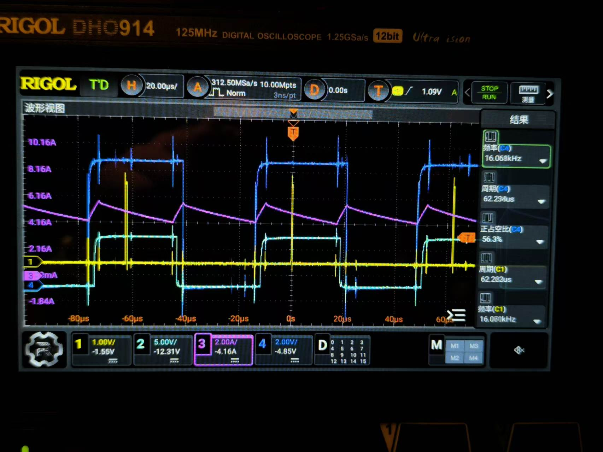
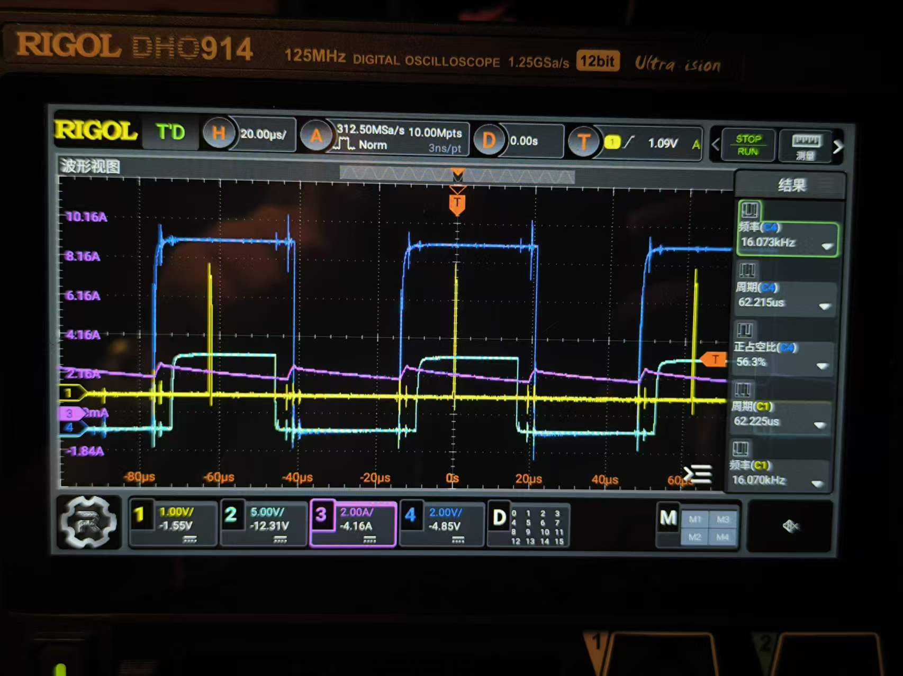
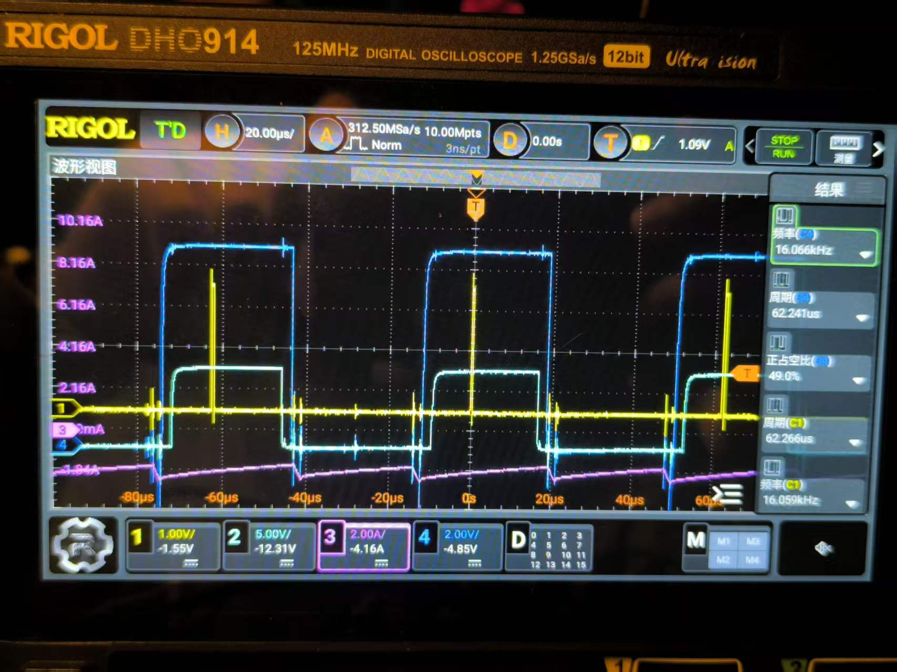
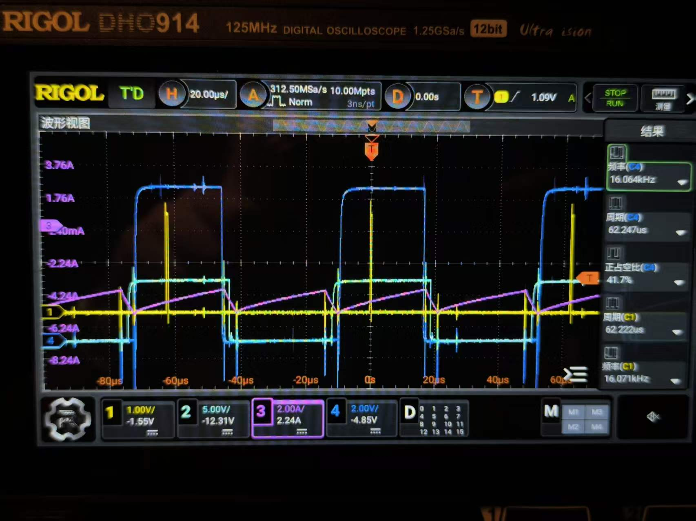
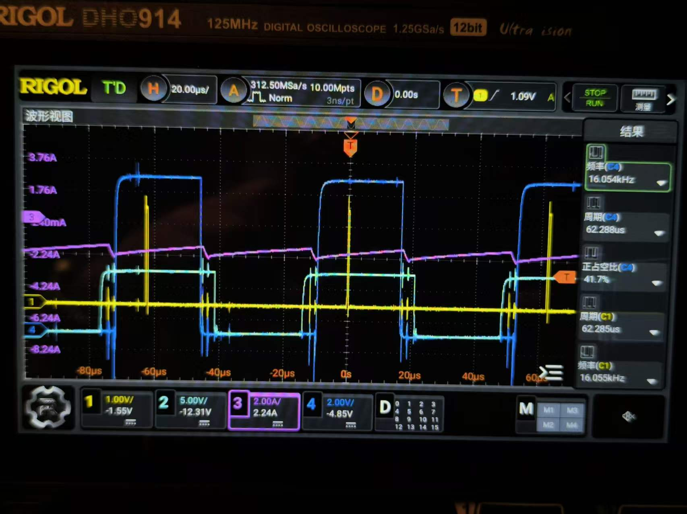
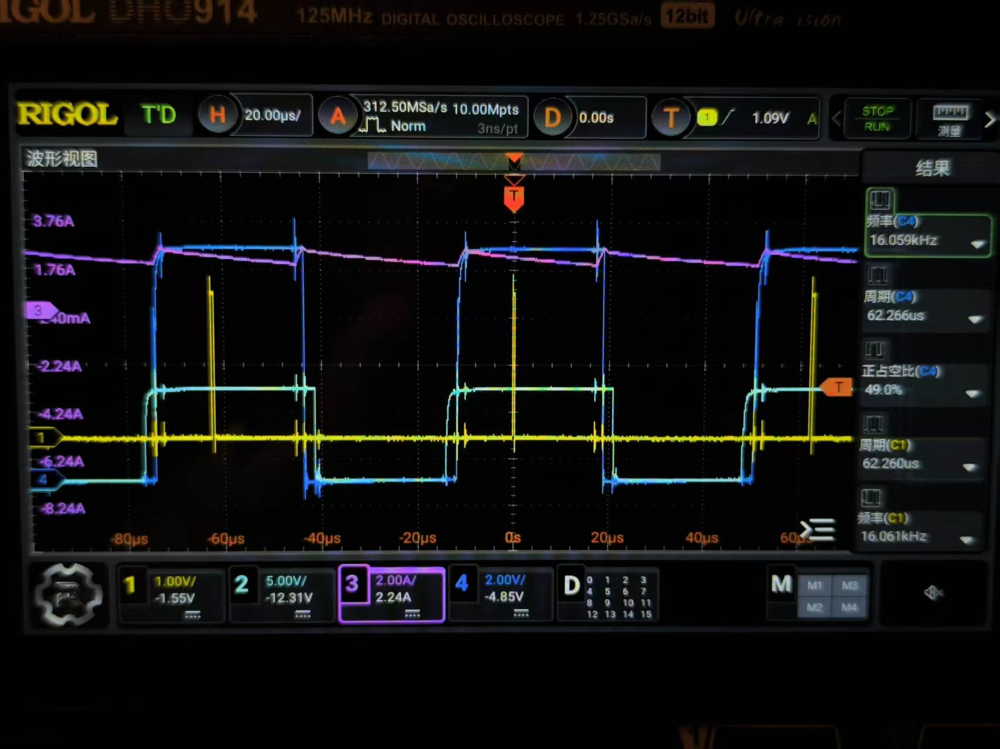

# 三相电流钳实测验证方案

## 1. 验证目标

使用临时借用的电流钳，验证以下内容：

- 电流采样的方向是否正确；
- ADC 换算电流与真实相电流的周期和变化趋势是否一致；
- 电流采样零点和增益是否合理；
- 六个固定扇区下的 PWM、低侧导通和 ADC 采样关系；
- 两相采样与第三相重构后的三相和是否接近零。

## 2. 本次代码准备

当前扇区测试期间仍会更新 ADC 电流原始值，因此发送 `sector 1` 到 `sector 6` 时，VOFA 中的电流数据应保持实时更新。发送 `sector 0` 后，软件扇区会清零，停止状态不会继续使用上一个扇区做电流重构。

当前参数：

```text
PWM 频率       16 kHz
PWM 周期       5249 ticks
ADC 触发点     3937 ticks
死区           0.5 us
电流采样       ADC1 注入 Rank 1~3
实际电流输入   ADC1 PA3 / PA4 / PA6
```

## 3. 接线和安全

1. 使用低母线电压和限流电源，先从较小电压开始。
2. 电流钳只夹一根相线，不能同时夹住同一相的去线和回线。
3. 确认电流钳方向、倍率、零点和示波器输入量程。
4. 示波器建议连接：电流钳输出、PE0、被测相低侧栅极；条件允许时再观察另外两相低侧栅极。
5. 电机和功率板固定牢靠，测试期间禁止接触功率部分。

## 4. 测试步骤

### 4.1 上电前检查

- 确认驱动器 SD 默认关闭；
- 确认示波器探头接地方式正确；
- 确认电流钳没有同时夹住同一相的两根导线；
- 确认串口为 `3000000, 8N1`，VOFA+ 使用 JustFloat。

### 4.2 固定扇区测试

依次发送，每个命令保持数秒：

```text
sector 1
sector 2
sector 3
sector 4
sector 5
sector 6
sector 0
```

每个扇区至少记录一组：

- `sector`；
- `cmp_u/cmp_v/cmp_w`；
- 电流钳实际波形和峰值；
- VOFA 的 `current_u_a/current_v_a/current_w_a`；
- VOFA 的 `current_sum_error_a`；
- PE0 脉冲周期和宽度；
- 被测相低侧栅极波形。

## 5. 判定标准

### 5.1 方向

电流钳方向与软件电流符号必须先统一。若电流钳正向时软件显示负值，先检查：

- 电流钳箭头方向；
- 运放输入正负端；
- 电流采样电阻方向；
- 软件电流符号。

不要在方向未确认前调整增益参数。

### 5.2 波形

- 电流钳波形与 ADC 电流波形应具有相同周期和变化趋势；
- 两者相位应基本一致，允许存在 ADC 采样和滤波带来的延迟；
- 三相电流应满足 `Iu + Iv + Iw` 接近零；
- 重构相应等于另外两相之和的负值。

### 5.3 幅值

先比较峰峰值和有效值，再比较平均值。幅值不一致时按以下顺序排查：

1. 电流钳倍率和示波器探头倍率；
2. ADC 电压换算中的 VDDA；
3. 电流采样电阻值；
4. 运放增益；
5. 电流零点偏移。

### 5.4 采样窗口

PE0 是 ADC 转换完成后的软件标记，不能直接表示 ADC 采样瞬间。判断采样窗口时，应同时观察被测相低侧栅极和三相 PWM：

- ADC 触发应位于低侧已经导通之后；
- 应避开上下管切换和死区；
- 应距离下一次换相保留足够建立时间；
- 电流钳波形不应在 ADC 采样对应位置出现明显开关尖峰。

当前 `CCR4=3937` 只对已验证的测试占空比提供理论保证，不能直接证明完整 SVPWM 调制范围内所有占空比都满足采样窗口要求。

## 6. 数据记录表

| 扇区 | cmp_u | cmp_v | cmp_w | 电流钳方向 | 电流钳峰值 | ADC 峰值 | 三相和 | 结论 |
|---|---:|---:|---:|---|---:|---:|---:|---|
| S1 | 3003 | 2625 | 2246 | 已记录 | 待补 | 待补 | 待补 | PWM 排序已确认 |
| S2 | 2625 | 3003 | 2246 | 已记录 | 待补 | 待补 | 待补 | PWM 排序已确认 |
| S3 | 2246 | 3003 | 2625 | 已记录 | 待补 | 待补 | 待补 | PWM 排序已确认 |
| S4 | 2246 | 2625 | 3003 | 已记录 | 待补 | 待补 | 待补 | PWM 排序已确认 |
| S5 | 2246 | 2625 | 3003 | 已记录 | 待补 | 待补 | 待补 | PWM 排序已确认 |
| S6 | 3003 | 2246 | 2625 | 已记录 | 待补 | 待补 | 待补 | PWM 排序已确认 |

## 7. 结果判定

只有同时满足以下条件，才能认为当前采样链路基本可用：

1. 电流钳和 ADC 电流方向一致；
2. 两者周期和波形趋势一致；
3. 三相和明显小于单相电流幅值；
4. 六个扇区的 PWM 排序正确；
5. ADC 触发点避开低侧切换和死区；
6. 退出扇区测试后，电流重构状态恢复为无扇区状态。

若幅值仍不一致，先保留原始 ADC 电压和电流钳数据，不要直接修改软件增益。

### 7.1 当前判定状态

| 判定项目 | 当前状态 | 证据与说明 |
|---|---|---|
| 电流方向一致 | 基本确认 | 电流钳和 VOFA 的变化方向基本一致，仍需按相逐一记录箭头方向与软件符号 |
| 周期和波形趋势一致 | 已确认 | 示波器与 VOFA 均表现出稳定的周期性电流变化，PWM 频率约为 16 kHz |
| 三相和接近零 | 已确认 | 当前 VOFA 示例为 `1.9441 - 1.8976 - 0.0465 = 0.0000 A` |
| 六个扇区 PWM 排序 | 已确认 | S1~S6 已通过 `sector`、三相比较值和栅极波形完成记录 |
| ADC 触发点位于有效采样窗口 | 尚未确认 | PE0 是转换完成后的软件标记，还需与同一相高低侧栅极和电流钳同时观测 |
| 重构相与电流钳逐扇区一致 | 部分确认 | 当前只证明整体波形和三相关系合理，尚缺 S1~S6 的逐扇区定量对照 |
| 退出测试后恢复正常重构 | 部分确认 | 已增加退出测试时清除扇区状态的逻辑，还需上板验证退出测试后的连续运行结果 |

当前可以认为“扇区识别、PWM 排序、三相和及整体电流趋势”已经通过初步验证；“ADC 触发时刻”和“逐扇区电流重构精度”仍是剩余的关键判定项。

## 8. 当前实测结果：接线修正后稳定运行

### 8.1 测试条件

- PWM 频率约为 `16 kHz`，示波器测得约 `15.94 kHz`，周期约 `62.72 us`；
- 示波器 CH3 使用电流钳观测一相电流；
- VOFA+ 使用 JustFloat 接收 `current_u_a/current_v_a/current_w_a`；
- 示波器和 VOFA+ 的采样时刻、带宽和显示方式不同，不能直接逐点比较；
- 本次测试前重新确认并连接电机相线。

### 8.2 现象与定位

此前出现的运行抖动在重新连接电机相线后消失。该现象说明原问题最大可能来自电机相序、相线对应关系或接线接触状态，而不是由 TIM6 中断单独引起。

V/F 控制是开环输出，软件默认的 U/V/W 相序必须与电机实际绕组顺序一致。相序错误时，旋转磁场与转子运动方向不匹配，可能表现为抖动、噪声增大、电流异常或无法稳定旋转。修正接线后恢复稳定，是对该判断的重要硬件验证，但不能替代后续闭环控制中的相序和角度确认。

### 8.3 两种观测结果的解释

示波器上的电流钳波形接近正弦，并且可以看到 PWM 开关纹波；这是电流钳以较高采样率观察连续绕组电流的结果。VOFA+ 显示的是 MCU 在 PWM 同步采样点得到的离散数据，并且经过当前 ADC 采样、偏置处理和两相采样重构，因此可能表现为折线、局部台阶或纹波更明显。

本次 VOFA 截图中的一组瞬时值为：

```text
current_u_a =  1.9441 A
current_v_a = -1.8976 A
current_w_a = -0.0465 A
```

三相和为：

```text
1.9441 - 1.8976 - 0.0465 = 0.0000 A
```

这说明当前三相电流符号关系和第三相重构关系在该采样时刻是自洽的。示波器截图中电流钳显示的平均值约为 `121.6 mA`，该指标是长时间平均值，不能与 VOFA 的瞬时值直接比较。

### 8.4 当前结论

1. 电机重新接线后，运行抖动消失，当前 PWM 输出和电流波形稳定；
2. 电流钳波形与 VOFA 波形的周期和变化趋势基本一致；
3. VOFA 三相瞬时值满足 `Iu + Iv + Iw ≈ 0`，当前重构结果具有基本合理性；
4. 目前还不能仅凭这两张截图完成 ADC 采样点位于低侧有效导通区的最终证明；
5. 暂不修改电流采样增益和偏置参数，先完成不同扇区下的电流钳与 ADC 对照。

### 8.5 后续检验

1. 固定较低的安全转速和电流，分别记录 S1~S6；
2. 对每个扇区同时记录电流钳方向、峰峰值、VOFA 三相值和 `current_sum_error_a`；
3. 对比直接采样相与电流钳，对比重构相与 `-(另外两相之和)`；
4. 将 PE0、对应相高低侧栅极和电流钳同时接入示波器，确认 PE0 标记对应的采样窗口远离开关沿和死区；
5. 完成上述数据记录后，再进行电流零偏和增益标定，并单独进行版本管理。

## 8.6 电流采样零点与增益标定方案

当前电流采样已经完成基本方向、波形趋势和三相关系验证，但尚未完成与电流钳的定量增益标定。标定必须分为零点标定和增益标定两个阶段，不能把零点误差混入增益参数。

### 8.6.1 测试条件

- 使用电流钳测量实际相电流，并通过示波器或数据记录设备保存参考值；
- 通过串口和VOFA+记录ADC原始值、软件换算电流和校准状态；
- 使用低母线电压和限流电源；
- 电机处于静止或锁定状态，但必须施加稳定、可控的相电流。

无电流状态只能完成零点标定，不能得到增益参数。

### 8.6.2 零点标定

在功率级关闭、相电流为 `0 A` 时，分别采集三相ADC原始值并求平均：

```text
U_offset = average(U_raw)
V_offset = average(V_raw)
W_offset = average(W_raw)
```

三相分别保存零点偏移，不默认共用一个偏移值。后续换算先对每相执行：

```text
U_corrected = U_raw - U_offset
V_corrected = V_raw - V_offset
W_corrected = W_raw - W_offset
```

### 8.6.3 增益标定

完成零点修正后，施加稳定参考电流，同时记录电流钳测得的 `I_reference` 和当前软件换算值 `I_adc`。单点修正可以计算：

```text
gain_correction = I_reference / I_adc
I_calibrated = I_adc * gain_correction
```

正式标定不建议只使用一个电流点，应至少采集低、中、高三个电流点，并尽量包含正向和反向电流。零点已经独立标定时，增益拟合应尽量通过零点：

```text
I_reference = gain * I_adc
```

如果拟合出现明显截距，应优先检查零点、方向、采样窗口和电流钳倍率，不能直接把截距并入增益。

### 8.6.4 三相独立参数

如果三相采样电阻、运放增益或ADC通道比例存在差异，应分别保存 `offset_u/v/w` 和 `gain_u/v/w`。统一换算后，再依据 `sector_applied` 选择两相并重构第三相。不能直接对未经零点和增益校准的原始ADC码值执行重构。

### 8.6.5 参数保存与标定后验证

标定参数可以保存到内部Flash、EEPROM或外部Flash。建议同时保存参数版本、校准批次或时间、三相offset、三相gain、校准状态和CRC。读取参数时必须检查版本和CRC，参数无效时回退到明确的默认值并上报校准参数无效。

标定后应使用不同于标定点的电流条件复测，并计算：

```text
误差 = I_calibrated - I_reference
相对误差 = 误差 / I_reference
```

至少检查三相方向、低中高电流幅值、正反向对称性、三相和、直接采样相与重构相的一致性，以及不同PWM占空比和扇区下的稳定性。当前本节仅为标定设计方案，尚未完成电流钳定量标定，也不代表增益参数已经写入正式配置。

## 8.7 量产标定边界与简化方案

实验室验证中可能观察到低、中、高电流幅值差异、正反向差异、不同扇区波形差异以及温升后的参数变化。如果把每个电流点、正反向、六个扇区和所有温度条件都作为独立标定项，生产流程会过于复杂，无法满足正常量产要求。

需要区分采样链路误差和电机运行状态变化。理想采样链路在工作范围内应近似满足：

```text
ADC输入电压 ≈ 相电流 × 采样电阻 × 放大倍数 + 零点偏置
```

量产主要标定采样电阻、运放增益、ADC通道比例、三相零点和VDDA换算误差。电机反电动势、电感、PWM开关噪声、不同扇区的电流路径、绕组温升以及电流钳带宽造成的差异，不应直接全部归入ADC增益误差。

不同扇区重点验证采样窗口、重构关系和三相和，不为每个扇区保存独立增益参数。

量产时每块控制板保存三相独立的零点和增益参数，即 `offset_u/v/w` 与 `gain_u/v/w`。推荐流程为：

```text
硬件上电和自检
    -> 无电流状态采集三相零点
    -> 使用标准电流源或标定工装
    -> 分别让U/V/W通道通过已知参考电流
    -> 计算三相独立增益
    -> 写入Flash、EEPROM或外部Flash
    -> 校验参数版本和CRC
    -> 使用其他电流点抽检
```

普通精度产品可以采用单点或双点增益标定；精度要求更高时再增加多点线性验证。没有必要让每块板在六个扇区、多个转速和完整温度范围内重复标定。

运行时只保留必要的在线措施：停机零点校准、使用最近一次有效VDDA、检测ADC饱和和采样窗口失效、检查三相和误差，以及校验参数有效标志和CRC。温度补偿表属于更高精度产品的扩展，不是当前基础控制器量产标定的必要前提。

本节结论：量产标定的对象是采样硬件误差，不是电机全部运行状态。通过硬件一致性设计、三相独立零点和增益标定，以及运行时有效性监控，可以在保证测量可靠性的同时控制生产流程复杂度。

## 9. 实测波形附件

### 9.1 示波器电流钳波形

重新接线后，电流钳观测到的绕组电流整体接近正弦，PWM 纹波叠加在连续电流之上。该图用于确认电机运行是否稳定以及电流的实际连续波形。


### 9.2 VOFA+ 三相电流波形

VOFA+ 显示的是 PWM 同步采样和电流重构后的离散数据。当前截图中的一组三相瞬时值满足三相和接近零，可用于确认符号关系和重构关系。


### 9.3 S1~S6 扇区示波器记录

以下图片与第 6 节数据表中的 S1~S6 一一对应，用于对照 `PE0`、栅极波形、电流钳和当前扇区比较值：

| 扇区 | 波形记录 |
|---|---|
| S1 |  |
| S2 |  |
| S3 |  |
| S4 |  |
| S5 |  |
| S6 |  |
